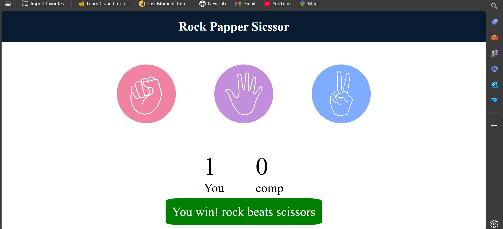
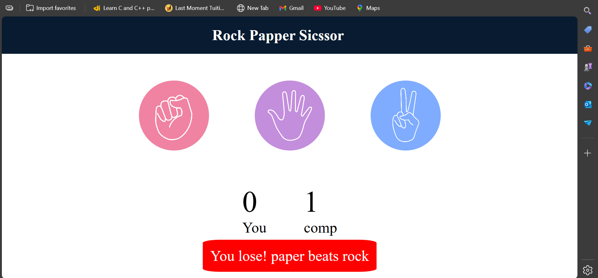
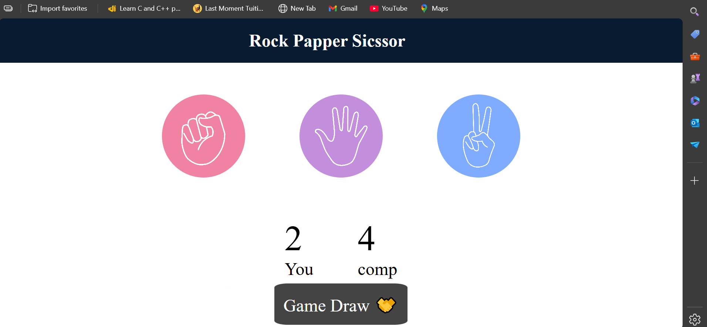

# 🎮 Rock Paper Scissors Game

A simple and interactive **Rock Paper Scissors** game built using **HTML, CSS, and Vanilla JavaScript**.  
The project focuses on DOM manipulation, event handling, and game logic without using any frameworks.

---

## 🚀 Live Demo
👉 *(Optional)* Add GitHub Pages link here  
Example: https://gaurav-vennamwar.github.io/Rock-Paper-Sissors/

---

## 📸 Screenshots

### 🖥️ Game Start


### 🎯 Playing the Game


### 🏆 Result & Score Update


> 📁 All screenshots are stored inside the `assets/` folder.

---

## ✨ Features

- Click-based Rock, Paper, Scissors selection
- Random computer choice generation
- Real-time result display (Win / Lose / Draw)
- Score tracking for both User and Computer
- Clean UI with instant visual feedback
- Beginner-friendly, readable JavaScript logic

---

## 🛠️ Tech Stack

- **HTML5** – Structure  
- **CSS3** – Styling  
- **JavaScript (ES6)** – Game logic & DOM manipulation  

No external libraries or frameworks used.

---

## 📂 Project Structure

Rock-Paper-Sissors/
│
├── index.html
├── style.css
├── app.js
├── assets/
│ ├── screenshot1.png
│ ├── screenshot2.png
│ └── screenshot3.png
└── README.md


---

## ▶️ How to Run Locally

1. Clone the repository:
   ```bash
   git clone https://github.com/Gaurav-Vennamwar/Rock-Paper-Sissors.git
-----

🧠 What I Learned

DOM selection & event listeners

Handling user interactions

Implementing game logic using conditions

Updating UI dynamically using JavaScript

Debugging real-world JavaScript issues
